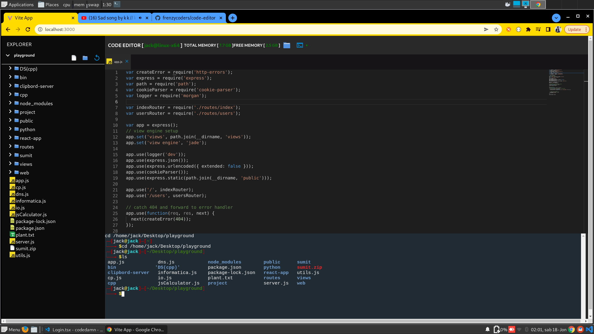

## User Interface 


    # Live Link [http://code-editor.myportfolio.club]


## SERVER SETUP 
    ```bash 
    cd code-editor/server
    ```
    ```bash 
    npm i 
    ```
    ```bash
    npm i -D
    ```
    ```bash 
    npm run dev
    ```

    - server started at port 8090 by using these commands

## CLIENT SETUP
    - open server_details.ts which is located in vite-ui/src/Types/ folder

